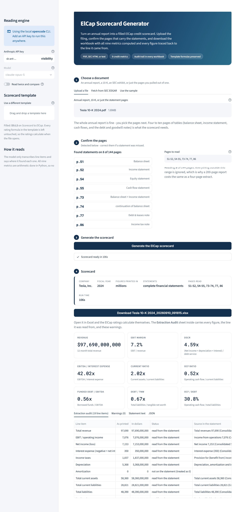

# ElCap Scorecard Generator

Turns a financial statement (PDF / SEC exhibit / text) into a populated
**ElCap Scorecard** Excel workbook, from a web page or the command line.

The 9 credit metrics (Revenue, EBIT Margin, DSCR, EBITDA / Interest,
Current Ratio, OCF Ratio, Funded Debt / EBITDA, Debt / TNW, OCF / Debt) are
written into `D5:L5` of the `Scorecard to ElCap` sheet in a copy of the ElCap
template. All of the template's rating formulas are preserved, so the ElCap
ratings calculate automatically when the file is opened in Excel.

Every generated workbook also carries an **Extraction Audit** sheet listing
each line item, the figure as printed in the statement, the figure in dollars,
whether it was read / confirmed absent / not found, and the verbatim statement
line it came from. A credit decision should not rest on a number nobody can
trace, so nothing is written without its source.

## The web app



```bash
pip install -r requirements.txt
streamlit run app.py
```

The browser opens on a four-step page: choose a document, confirm the pages,
generate, download.

**Choose a document.** Upload a PDF, an SEC HTML exhibit or a text file (up to
200 MB), pull a filing straight from SEC EDGAR by ticker, or load the bundled
sample. A whole annual report is fine — nothing is trimmed before you see it.

**Confirm the pages.** Every page of an uploaded PDF is classified, and the
ones carrying a balance sheet, income statement, cash flow statement, equity
statement, or a debt / goodwill / tax note are proposed as a page range with
the reason shown for each. Tesla's 2024 10-K, 144 pages, comes back as
`51-52, 54-55, 73-74, 77, 86`. Correct the range if a statement was missed;
only those pages are read, so a 200-page report costs what a four-page extract
costs. HTML and text filings have no pages and are read whole.

**Generate.** The same pipeline the CLI runs: text extraction, one LLM pass
that transcribes line items, then the nine metrics computed in Python.

**Download.** The workbook is offered as a download, and the page shows the
nine metrics, the full extraction audit (every line item, as printed, in
dollars, its status and the statement line it came from), the warnings, the
exact text that was sent to the model, and the extraction as JSON.

Nothing is written to the server except a copy of the upload in the system
temp directory; the workbook is built in memory and handed to the browser.

### Deploying it

The app runs anywhere Streamlit runs. On
[share.streamlit.io](https://share.streamlit.io):

1. Push this repository to GitHub (`.gitignore` already excludes
   `.streamlit/secrets.toml`, `output/` and uploaded filings).
2. Create an app pointing at **this** repository with **`app.py`** as the main
   file. Streamlit Cloud remembers one repository and entry point per app; an
   app still pointing at a different repository will keep failing on that
   repository's imports, however healthy this one is.
3. In **App settings → Secrets**, add the API key:

   ```toml
   ANTHROPIC_API_KEY = "sk-ant-..."
   ```

4. Deploy. `requirements.txt` installs Streamlit, the Anthropic SDK and the
   PDF readers; nothing else is needed.

#### Using a compatible gateway instead of the Anthropic API

Any service that speaks OpenAI's `/chat/completions` works — Open WebUI,
LiteLLM, vLLM, a university or company AI gateway. Set three secrets instead
of `ANTHROPIC_API_KEY` (or fill the same fields in the app's sidebar):

```toml
ELCAP_COMPAT_BASE_URL = "https://gateway.example.edu/api"
ELCAP_COMPAT_API_KEY  = "sk-..."
ELCAP_COMPAT_MODEL    = "claude-sonnet-5"
```

The model name has to be exactly what that gateway calls it; gateways do not
agree on a default, so the app refuses to guess one.

**A gateway behind Cloudflare Access needs more than a key.** Many university
gateways — `chat.tamu.ai` among them — sit behind Cloudflare Access, which
bounces any request without an SSO session to a sign-in page *before* the
gateway ever sees the API key. From a browser on campus this is invisible;
from a server it fails every time, and the reply is a 200 carrying an HTML
login page rather than an error. Such a deployment also needs a Cloudflare
Access **service token**, issued by whoever runs the gateway:

```toml
ELCAP_COMPAT_HEADERS = '{"CF-Access-Client-Id": "...", "CF-Access-Client-Secret": "..."}'
```

The app detects that bounce and names it, rather than reporting a parse error
that would send you hunting for a bug in the key.

Locally you can instead copy `.streamlit/secrets.toml.example` to
`.streamlit/secrets.toml`, export the variables, or paste them into the
sidebar for one browser session. With no key at all the app falls back to
whichever LLM CLI is installed on the machine — useful for local work, but a
hosted deployment has none, so a key is what makes the site work for everyone
else.

**Cost per scorecard.** One request. Eight pages of statements are roughly
25–35K input tokens; on `claude-opus-5` that is a few cents. Selecting pages
rather than sending the whole filing is most of that saving.

## How it works

```
Financial statement (PDF / HTML exhibit / TXT)
        |
        v
extract_pdf_text.py   -> the selected pages as raw statement text
                         (and, for a PDF, which pages hold the statements)
        |
        v
llm_extract.py        -> the Anthropic API, an OpenAI-compatible gateway, or
                         an LLM CLI (opencode / claude / codex / gemini)
                         reads the text and returns the line items as JSON:
                         figures exactly as printed + the statement's units
                         + which items are genuinely absent + source quotes
        |
        v
compute_metrics.py    -> units normalised to dollars, then the 9 metrics
                         are computed deterministically in Python
        |
        v
fill_excel.py         -> template copied, D5:L5 written, audit sheet added
```

`app.py` (the web app) and `main.py` (the CLI) both drive that pipeline
through `scorecard_pipeline.build_scorecard`, so the two cannot compute
different numbers from the same document.

The LLM only **reads** the statement. Every metric is arithmetic done in
Python, so no rating depends on the model's own maths.

## Command-line usage

```bash
python src/main.py                                  # interactive menu
python src/main.py "sample/input/Audited Financial Statements.pdf"
python src/main.py input/*.pdf --verify             # batch, two-pass check
python src/main.py --ticker CAT --ticker DE         # pull from SEC EDGAR
```

| Flag | Meaning |
|------|---------|
| `--verify` | read the statement twice and report line items the two passes disagree on |
| `--json FILE` | also dump the extracted line items, sources and metrics as JSON |
| `--out-dir DIR` | where workbooks are written (default `output/`) |
| `--template XLSX` | scorecard template to fill |
| `--cli {auto,api,compat,opencode,claude,codex,gemini}` | LLM backend (`api` = the Anthropic API, `compat` = an OpenAI-compatible gateway) |
| `--model ID` | model id passed to the backend |

Generated workbooks land in `output/` as `<source name>_<timestamp>.xlsx`.

With no arguments the interactive menu offers the same three entry points:
a file path, a file from `input/`, or an SEC EDGAR ticker download.

## Requirements

- Python 3.10+
- An `ANTHROPIC_API_KEY`, a compatible gateway, **or** one of the supported
  CLI LLMs on `PATH` (or pointed to by its path env var):
  - **opencode** (`opencode run`) — https://opencode.ai
  - **Claude Code** (`claude -p`) — https://claude.com/claude-code
  - **OpenAI Codex** (`codex exec`) — https://developers.openai.com/codex
  - **Google Gemini** (`gemini`) — https://github.com/google-gemini/gemini-cli
- Excel (optional, to view the computed ratings)

```bash
pip install -r requirements.txt
```

### Choosing the backend

| Variable | Default | Meaning |
|----------|---------|---------|
| `ANTHROPIC_API_KEY` | *(unset)* | enables the `api` backend, which `auto` prefers first |
| `ELCAP_COMPAT_BASE_URL` / `ELCAP_COMPAT_API_KEY` / `ELCAP_COMPAT_MODEL` | *(unset)* | enable the `compat` backend (an OpenAI-compatible gateway) |
| `ELCAP_COMPAT_HEADERS` | *(unset)* | JSON object of extra request headers, e.g. a Cloudflare Access service token |
| `ELCAP_LLM_CLI` | `auto` | `auto`, `api`, `compat`, `opencode`, `claude`, `codex`, `gemini` |
| `ELCAP_MODEL` | *(backend default)* | model id passed to the backend |
| `OPENCODE_PATH` / `CLAUDE_PATH` / `CODEX_PATH` / `GEMINI_PATH` | *(from `PATH`)* | explicit executable path |

With `auto` the Anthropic API is used whenever `ANTHROPIC_API_KEY` is set,
then a configured gateway, and otherwise the first available of
opencode → claude → codex → gemini. The API and gateway paths are the only
ones that work on a hosted server, where no CLI is installed and nobody is
logged in; both send the same prompt and parse the reply with the same code.

**Backend testing status.** Every statement in `output/` was read by
**opencode** or by the Anthropic API path. The `claude`, `codex` and `gemini`
paths are covered three ways: unit tests pin the argv each backend builds and
how its stdout is parsed; the whole pipeline was run end to end against a stub
CLI standing in for each of them; and all three share the same plain-stdout
reply path. What has *not* been checked is a real `claude` / `codex` /
`gemini` binary — flags change between releases, so confirm one statement by
hand the first time you switch backend. The `compat` gateway path is likewise
covered by unit tests (endpoint construction, headers, both reply shapes, and
the Cloudflare Access bounce) but has not been run against a live gateway.

```powershell
$env:ELCAP_LLM_CLI = "api"
$env:ELCAP_MODEL   = "claude-opus-5"
python src\main.py
```

All CLI backends receive the prompt over **stdin** (never the command line),
so long statements work even where the OS limits argument length. The exact
subprocess invocations are:

- `opencode run --format json --dir <cwd>` (reply parsed from NDJSON events)
- `claude -p` (print mode, reply on stdout)
- `codex exec - --skip-git-repo-check --ephemeral`
- `gemini` (non-TTY stdin is treated as a single headless prompt)

## Measured accuracy on real PDFs

Five accountant-prepared audited statement PDFs (electric cooperatives, 26–60
pages, filed with state regulators) were run end to end. For three of them
every line item was transcribed by hand off the PDF first, each cross-checked
against a subtotal that has to foot — so the comparison is against the
document, not against a second model run.

| | |
|---|---|
| Line items compared | **51** across 3 documents |
| Read exactly right | **49 (96.1%)** |
| Wrong figures | **0** |
| Judgement calls | 1 (whether "taxes other than income" is an add-back) |
| Not found | 1 (an amortization line reported as null rather than zero) |
| Fiscal year picked | 3/3 correct — the current column, not the prior year |
| Unit scale | 3/3 correct (two raw-dollar, one "in thousands") |

Two figures first scored as errors turned out to be errors in the *hand-built*
ground truth: the extractor had found an intangible-plant balance and two
amortization add-backs in the notes that the manual read missed.

Derived values are handled correctly too. Neither Salt River nor Rappahannock
prints a "Total liabilities" line; both were computed by subtracting equity
from the balance-sheet total, and the audit sheet records the subtraction.

**Run-to-run stability** (same PDF read five times): 16 of 19 line items
identical every time, and fiscal year, unit scale and statement basis were
stable 5/5. The variation that remains is in how interest expense is
aggregated (±8% on EBITDA/Interest) and in derived totals (±0.0002%). Checked
against the template's own bands, that variation moved one rating by a tenth
of a notch (Funded Debt/EBITDA 13.1 vs 13.2) and left DSCR, EBITDA/Interest
and every other rating unchanged. Use `--verify` when a single run has to be
trusted on its own.

**Tesla FY2024 10-K, read through the web app** (144-page PDF, 8 pages
selected): all 19 line items read, 0 warnings, 9 of 9 metrics computed.
Revenue $97,690MM, income from operations $7,076MM, current assets $58,360MM,
current liabilities $28,821MM, total liabilities $48,390MM, equity $72,913MM
and operating cash flow $14,923MM all match the filing exactly.

## Tests

```bash
pip install pytest
python -m pytest tests/ -q
```

The suite runs without an LLM. It pins the metric engine to two hand-checked
fixtures: the worked example the ElCap workbook itself ships in `D5:L5` (where
a human wrote the arithmetic straight into the cells, e.g.
`=(-35+141+55)/(144+55)`), and Zencoder Inc. FY2011 transcribed from the sample
audited statements. It also covers unit scaling, absent-vs-unknown handling,
LLM reply parsing, the gateway backend's request and error handling, and the
Excel round trip.

## Metrics

Derived from the most recent full fiscal year:

| # | Metric | Formula |
|---|--------|---------|
| 1 | Revenue | 12-month total revenue |
| 2 | EBIT Margin | EBIT / Revenue |
| 3 | DSCR | (Net income + Depreciation + Interest) / (Current LTD + Current finance leases + Interest) |
| 4 | EBITDA / Interest | EBITDA / Interest expense |
| 5 | Current Ratio | Current assets / Current liabilities |
| 6 | OCF Ratio | Operating cash flow / Current liabilities |
| 7 | Funded Debt / EBITDA | (Line of credit + Current LTD + Current fin. leases + LTD + LT fin. leases) / EBITDA |
| 8 | Debt / TNW | Total liabilities / (Equity − Goodwill − Intangibles) |
| 9 | OCF / Debt | Operating cash flow / Total liabilities |

EBITDA = Net income + Interest + Taxes + Depreciation + Amortization.

### How missing figures are treated

The distinction between "the statement shows no such item" and "we could not
read it" drives whether a metric is scored or left blank:

- **Confirmed absent** (e.g. a balance sheet with no borrowings at all) → the
  item is 0, so a debt-free company scores Funded Debt / EBITDA of 0.
- **Not found** → the metric is left blank rather than scored on a guess. The
  audit sheet marks it `NOT FOUND`.
- **EBITDA add-backs** (interest, tax, D&A) missing individually are treated as
  zero so one absent line does not blank two metrics; the audit sheet and the
  console both say which were assumed zero.
- **No operating cash flow statement** → OCF is approximated as net income
  + D&A, and flagged as an approximation.
- **Interest income rather than expense** → DSCR and EBITDA / Interest are
  blanked; there is no interest expense to cover.

### Units

Audited statements are usually printed "(in thousands)" or "(in millions)".
The extractor returns figures **exactly as printed** plus the statement's unit
scale, and Python applies the multiplier. This matters because the scorecard's
Revenue bands are absolute dollars: a statement in thousands read as raw
dollars understates revenue 1000x and mis-rates the company. Both columns are
shown side by side on the audit sheet, and two 1000x-error signatures are
flagged automatically.

## Project layout

```
Elcap_ML/
  app.py             the web app (Streamlit)
  .streamlit/        theme + a secrets template for the API key
  docs/              screenshot used by this README
  sample/            original sample PDF + the ElCap scorecard workbook
  template/          the ElCap scorecard template (staged copy)
  input/             drop files here, or EDGAR downloads land here
  output/            generated scorecards
  tests/             pytest suite (no LLM required)
  src/
    main.py                CLI + interactive menu
    scorecard_pipeline.py  one statement -> metrics + workbook bytes
    extract_pdf_text.py    PDF / HTML / TXT -> text, page classification
    llm_extract.py         extraction to JSON (Anthropic API, an
                           OpenAI-compatible gateway, or a CLI)
    compute_metrics.py     unit normalisation + the 9 deterministic metrics
    fill_excel.py          write D5:L5 and the Extraction Audit sheet
    edgar_fetch.py         SEC EDGAR download (exhibit + XBRL fallback)
```

## Notes / limitations

- **`sample/output/` is not the answer key for `sample/input/`.** The workbook
  in `sample/output/` holds a worked example for a company with ~$2.8MM
  revenue, negative tangible net worth and ~$444K of funded debt. The sample
  PDF is Zencoder Inc. FY2011: $707,868 of revenue, no borrowings and positive
  equity. The two are unrelated, so the pair cannot be used to score
  extraction accuracy. `template/ElCap Scorecard Template.xlsx` is a copy of
  that same workbook, worked example included — every run overwrites all nine
  cells, so none of it leaks into a generated scorecard.
- The scorecard's Revenue bands run $10MM–$350MM. A smaller company is not
  rejected: `MATCH(...,-1)` has no floor, so revenue under $10MM is pinned to
  the bottom band and rated 20 (Ca-C) on size alone. The tool warns when this
  happens.
- The EDGAR XBRL fallback is best-effort. Companies that use custom extension
  tags (Caterpillar tags no standard interest expense) or file an unclassified
  balance sheet (Deere reports no current assets/liabilities) will have those
  items marked "not tagged"; the affected metrics are left blank. Figures that
  exist only for an earlier fiscal year are marked stale and not used.
- **Scanned PDFs.** An image-only PDF is rejected with a clear error; OCR is
  not included. A *partly* scanned file — a typed cover page in front of
  scanned statements — still extracts, so it is checked separately: a PDF
  averaging under 250 characters per page, or with more than a quarter of its
  pages carrying no text, is flagged before the model runs, and the warning
  names the pages that need OCR. The average alone is not enough, because one
  wordy cover page lifts it over any threshold.
- **Page detection is a proposal, not a verdict.** The classifier looks for a
  statement heading in the top of each page and for a page dense enough with
  figures to be a table. It errs towards offering an extra note page rather
  than missing a statement, and the reason for every page is shown so a wrong
  guess is visible. Check it on an unfamiliar filing format.
- **EBIT.** The scorecard defines EBIT as net income + interest + taxes, but
  the workbook's own worked example uses a reported operating-income subtotal
  instead, so the two disagree. The tool uses a reported subtotal only when it
  is struck *before* interest expense, and otherwise falls back to the written
  definition. This matters for utilities, cooperatives and many
  not-for-profits, which bury interest inside operating expenses: taking their
  "operating margins" line at face value scored one co-op's EBIT margin at
  −0.01% when the definition gives 6.27%.
- Reading the statement is the only non-deterministic step. `--verify` runs it
  twice and reports any line item the two passes disagree on by more than 0.5%.

## Two open issues in the template itself

Neither is caused by this tool, and neither has been changed — the template is
yours to decide about. Both are reproducible by opening
`template/ElCap Scorecard Template.xlsx` in Excel.

**1. A blank input still gets rated.** Fill `D5:L5` with blanks and recalculate:
every column still prints an ElCap rating, and `D7` still prints a combined
score (15.01). Columns **J** (Funded Debt / EBITDA) and **K** (Debt / TNW) rate
a blank as **1 — Aaa, the best possible rating**, because their array formulas
read a blank cell as 0 and `IF(J5<0,20,...)` is then false. The other seven
rate a blank as 20 or 16.3. So a statement the tool could not read produces a
scorecard that looks complete and rates leverage as best-in-class. The tool now
prints a warning naming every blank metric, and repeats it on the audit sheet
and in the web app, but it cannot stop the template from scoring the blank.

**2. The OCF Ratio and OCF / Debt band columns look swapped.** On
`Scorecard to ElCap`, the block headed `Z6 = "OCF Ratio"` holds
`25, 23.3333, 21.6667…` — the *OCF / Debt* percentage bands from the
Judgmental Scorecard (`N`: `>25.0000%`, `25.0000% - 23.3333%`). The block
headed `AF6 = "OCF / Debt"` holds `3.4873, 3.3638, 3.2415…` — the *OCF Ratio*
multiples (`K`: `3.4873x - >3.5000x`). The formulas follow the headers
(`I6` looks up in `$AA$`, `L6` in `$AG$`), so each of those two metrics is
scored against the other's bands. A second mismatch compounds it: the OCF/Debt
bands are written as percentage numbers (25 = 25%) while EBIT Margin's are
decimals (0.45 = 45%), so an OCF/Debt of 15.3% must arrive as `15.3`, not
`0.153`. Until this is settled, ratings for metrics 6 and 9 should not be
relied on — the values in `I5` and `L5` are correct, only the lookups are not.
